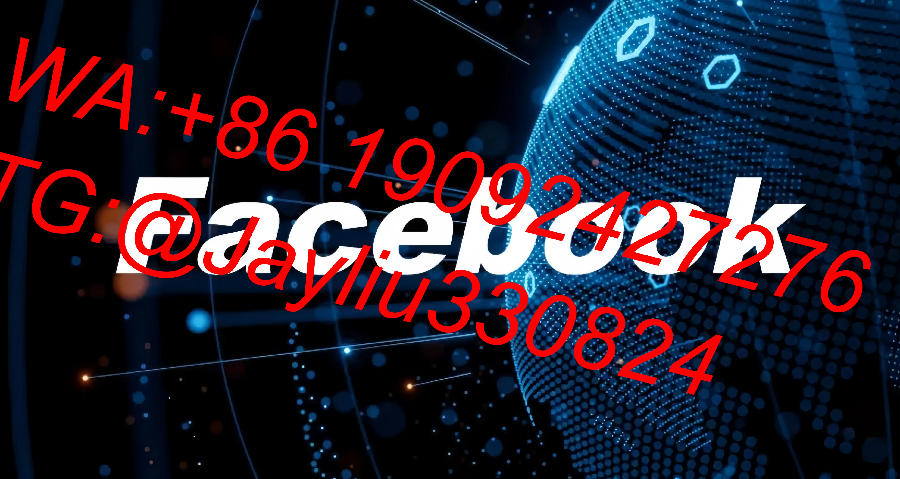

# Facebook广告实战优化全攻略

---

## 一、广告账户高效搭建指南

### 1.1 梯度式架构设计
**测试验证层**
- 初始预算：$40-60/系列，3-5个广告组
- 兴趣词策略：ChatGPT生成+语义扩展工具优化[^2]
- 起量标准：CTR≥1.8%、CPM<$15时晋级

**核心运营层**
| 层级类型       | 预算分配 | 核心功能              |
|----------------|----------|-----------------------|
| 基础拓客账户   | 40%      | 兴趣词组合投放        |
| 精准延伸账户   | 35%      | 类似受众挖掘          |
| 再营销蓄水池   | 25%      | LAL(Lookalike) 用户转化|

---

## 二、创意革命性测试方案

### 2.1 爆款素材生成流程
```process
STEP1：创建4个素材组合(2图+2视频交叉测试)
STEP2：统一兴趣定向+版位设置
STEP3：24小时数据监测：
    ▸ 图文组看ROI
    ▸ 视频组看完成率(≥80%)
STEP4：优胜素材晋级主投账户
```

### 2.2 PAS文案模型模板
| 模块         | 范例内容（美妆类）            |
|-------------|------------------------------|
| **痛点触发** | "妆容斑驳的尴尬还在忍受？🌚"   |
| **方案呈现** | "24小时持妆黑科技💄"          |
| **信任证明** | "1000+测评达人力荐🌟"         |
| **行动刺激** | "前100名赠定制化妆包→"        |

---

## 三、智能受众运营矩阵

### 3.1 四层用户运营策略
| 人群层级 | 定义标准               | 投放策略              |
|---------|-----------------------|-----------------------|
| L1      | 3天加购未支付用户      | 7折券+库存预警        |
| L2      | 7天深度浏览用户        | 产品评测+专属客服      |
| L3      | 15天同类目搜索用户      | 场景植入+替代方案      |
| L4      | 30天复购周期用户        | VIP权益+新品预告       |

### 3.2 再营销技术组合
**落地页像素部署**
```bash
基本事件设置：
1. ViewContent(浏览关键页)
2. AddToCart(加入购物车)
3. Purchase(完成交易)

高级策略：
→ 购物车放弃用户次日召回
→ 浏览超过3页用户强化卖点
→ 支付失败用户专属客服通道
```

---

## 四、实时动态调控方案

### 4.1 紧急情况应对
**异常处理SOP**
```plaintext
触发条件：
▶ CPM突增30%+
▶ CTR暴跌20%+

处置流程：
1️⃣ 立即暂停问题广告组
2️⃣ 复制作业调整出价(-15%~20%)
3️⃣ 00:00时段重启测试
4️⃣ 补充3组备用素材
```

### 4.2 预算调控模型
**四象限分配法**


---

## 五、长效运营监测体系

### 5.1 核心健康指标
| 监测维度       | 安全阈值      | 处置方案                |
|----------------|--------------|------------------------|
| 频次指标        | <4次/周      | 自动清洗30天旧用户      |
| 点击成本        | <$0.9        | 优化落地页加载速度      |
| 创意疲劳度      | >30%重复展示  | 紧急启用替代素材库      |

### 5.2 数据化复盘模板
**月度优化清单**
- ✔ 更新500+核心兴趣词库
- ✔ 验证所有Pixel事件埋点
- ✔ 清洗低频次投放受众(>7天)
- ✔ 测试3套新版位组合策略

---

> **运营日历提醒**
> 每周一进行素材库更新（新增≥5组）
> 每月5号执行受众大清洗
> 季度首日优化账户结构
> 促销日前14天启动压力测试
> [教学视频](https://youtube.com/shorts/3KMIJJh7jjI?feature=share)
